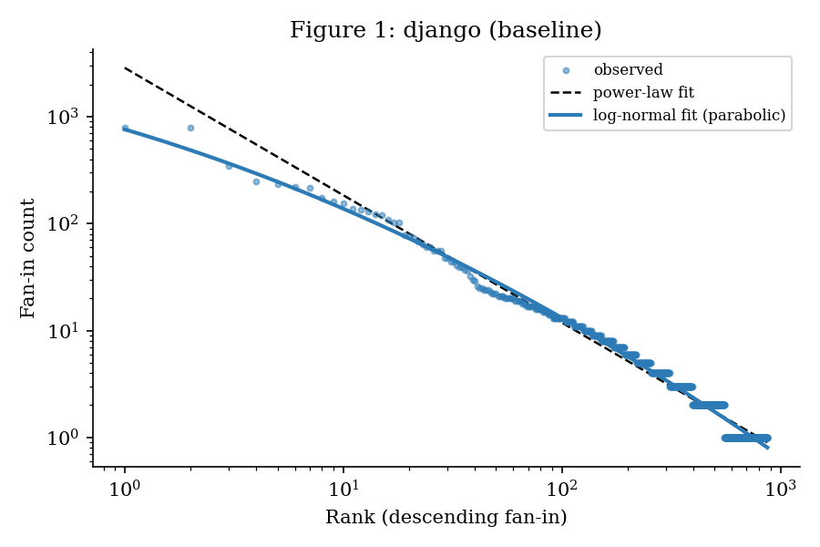
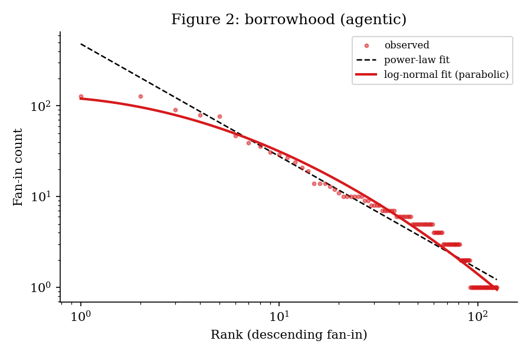
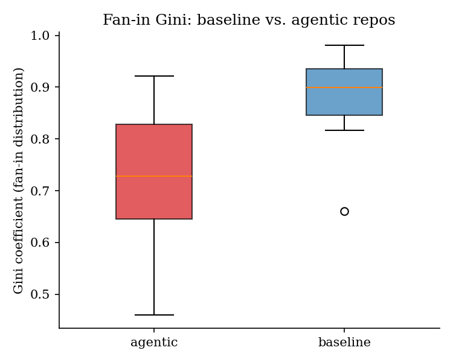

אִם יִרְצֶה הַשֵּׁם

# Fan-In Distributions in Human-Written vs AI-Generated Python Codebases: A Constructal Law Analysis

by **Daniyel Yaacov Bilar**, Chokmah LLC, chokmah-dyb@pm.me , ORCID: [0000-0002-9040-6914](https://orcid.org/0000-0002-9040-6914)

י״ב תִּשְׁרֵי תשפ״ז

------

## Version Note and Errata (v1.1)

This is version 1.1 of the paper released as v1.0.0 (paper doi: 10.5281/zenodo.20313669; code and data doi: 10.5281/zenodo.20318458). It corrects eight errors in v1.0.0, extends the longitudinal pilot from two repos to all eight Cohort A repos that meet its inclusion criteria, and adds a post-release audit (Section 7.7). The main cross-sectional result, lower fan-in Gini in Cohort B, holds; E1 lists the secondary results that weaken. The longitudinal result, no Gini decline after adoption, holds with eight repos in place of two. Every number below is recomputed by `python scripts/check_paper_claims.py`, which exits nonzero on any mismatch.

**E1. Cohort A contains AI signals.** v1.0.0 described Cohort A as human-written without qualification. In the 15 snapshots measured in Section 4, 421 of 221,145 commits (0.19%) carry a declared AI attribution, in 9 repos (386 in pandas), and the Django snapshot adds an AI configuration file (2026-03-05). By this paper's own definition of adoption (Section 5.1), 10 of the 15 Cohort A repos had adopted AI tools before their snapshot. In this paper "human-written" means a project founded and maintained by people before AI coding tools existed. With the 10 removed, Cohort A Gini remains higher than Cohort B Gini (exact Mann-Whitney p=0.027, r=-0.70 against -0.74 with all 15), and so does $$z_{lr}$$ (p=0.014). Normalized entropy (p=0.064), DAIC (p=0.28), and leaf fraction (p=0.13) lose significance. The five remaining repos are small (median 83 Python files, against 428 for the ten removed), and DAIC grows with repo size (Figure 4). Details in Section 7.7.

**E2. Celery adoption date.** v1.0.0 gives 2025-05-08. No Celery commit on that date carries an attribution marker; the earliest, 5c1a13c, is dated 2025-05-09. The released `find_adoption_date.py` returned neither date: its parser tested only the first line of each commit and fell back to the configuration-file date, 2025-08-26. The parser is fixed. Both dates fall in May 2025, and re-walking Celery reproduces its v1.0.0 timeline exactly, so its Section 6 results are unchanged.

**E3. aiohttp adoption date.** v1.0.0 cites a Claude co-authored aiohttp commit on 2026-05-04. No aiohttp commit on that date mentions Claude or Anthropic; the earliest attributed commit is edc1cc2, dated 2026-05-16. aiohttp stays excluded: it has no post-adoption snapshot before its collection snapshot (2026-05-18).

**E4. Reference date for lags and Figure 5.** `detect_changepoint.py` measures change-point lags from the first monthly snapshot on or after the adoption date, and `plot_timeline.py` draws the dashed line of Figure 5 at that snapshot. v1.0.0 labeled both as the adoption date. The two Django rows of v1.0.0 Table 6.3 reported as -4 days were computed by hand from 2026-03-05; the script gives -31 days.

**E5. Figures 2, 3, and 4 were stale.** They were rendered before the second wave of Cohort B repos was added and were not redrawn. Figure 2 showed loki-mode while its caption named borrowhood, and Figures 3 and 4 showed 8 Cohort B repos instead of the 12 the text reports. Redrawn from the released data with the released script, Figure 3 puts the Cohort B median at 0.728 instead of the plotted 0.747, and its lower whisker reaches 0.460 (codebase-mcp), so the gap between the groups is slightly larger than v1.0.0 showed. The caption of Figure 4 is rewritten to match the full data. The statistics in the text were computed from the full data in v1.0.0 and are unchanged.

**E6. The pilot studied two of eight eligible repos.** Six more Cohort A repos meet the pilot's inclusion criteria: NumPy, pandas, pytest, FastAPI, Scrapy, and Pydantic, all of which declare AI assistance through commit trailers and have no AI configuration file in their snapshots. v1.0.0 does not record how its candidate scan was run, so why these six were missed is unknown. v1.1 adds the six (Sections 5 and 6). It also takes snapshots from the mainline (first-parent) history; in NumPy, pytest, Scrapy, and Pydantic the unrestricted rule picked 31 commits from branches not yet merged on the snapshot date. For Celery and Django every snapshot is unchanged.

**E7. $$z_{lr}$$ p-value in the Conclusion.** v1.0.0 gave p=0.019 for the $$z_{lr}$$ difference between the cohorts; 0.019 is the DAIC p-value. The $$z_{lr}$$ comparison gives p=0.0073 (r=-0.61).

**E8. Change-point method.** v1.0.0 Section 5.3 stated that change-points came from PELT with a BIC-selected penalty. `detect_changepoint.py` uses PELT only if the optional `ruptures` package is installed, and `ruptures` is not among the project's requirements. The script's fallback, a single change-point scan that maximizes the difference between the mean before and after (Section 5.3), reproduces all six v1.0.0 change-points exactly, so the published results come from the fallback. v1.1 states the method used and pins `pilot_summary.py` to it.

**C1. Wording.** "Adoption date" throughout means the date of the first declared AI attribution in commit messages or configuration files. AI tool use without such a marker cannot be detected from repository history and is outside the scope of this paper.

**C2. Figure captions.** The captions were present in the v1.0.0 source but were not printed in its PDF. v1.1 prints them.

**C3. Cohort B description.** v1.0.0 described Cohort B as applications built by AI agents. The repos were selected by declared AI signals (Section 3.1), and v1.1 describes them that way.

------

## Abstract

Import fan-in, the number of intra-repo modules importing a file, encodes hierarchical coupling structure. By analogy with Constructal flow systems (Bejan 1997), we hypothesize that finite networks shaped by iterative optimization develop log-normal, not power-law, size distributions. We measure fan-in across 15 mature Python OSS projects (Cohort A) and 22 AI-attributed repositories created 2024-2026 (Cohort B, identified by AI attribution signals; skewing toward single-author, short-lived projects). In Cohort A, 14/15 show log-normal fan-in (model-selection z > 1.96, Gini mean 0.882). In Cohort B, three repos show zero intra-repo imports (Gini=0.000), 7 more are too small or inaccessible to fit, and among 12 fitted repos Gini mean is 0.725 (Mann-Whitney p = 0.0011, r = -0.744); the Gini gap holds without the ten Cohort A repos carrying declared AI signals (p=0.027). We term this the **agentic flattening effect**. We note a partial framework confound: at least three Cohort B repos are FastAPI-style backends whose thin-router design independently reduces intra-repo coupling. An exploratory longitudinal pilot on the eight mature repos that meet its inclusion criteria detects no Gini decline after declared AI adoption (Gini rose in 6 of 8; pooled exact Wilcoxon p=0.195) over 2 to 12 post-adoption months, and the log-normal signal moves in no consistent direction. Without a matched control group, the pilot cannot separate a structural-genesis explanation (flattening confined to new projects) from a null effect on mature codebases. If confirmed in larger samples, the cross-sectional flattening implies that maintainability risk from AI coding concentrates at project inception.

------

## Plain-Language Summary

**Software engineer / architect:** We parsed every `import` statement in 37 Python repos (15 mature OSS, 22 publicly AI-attributed), fitted distributions on the 27 with sufficient coupling, and measured how unequally fan-in is distributed (Gini) and whether the rank-frequency curve is log-normal or power-law (AIC + $$z_{lr}$$ test). Human-written repos: Gini 0.88, log-normal wins 14/15. AI-attributed repos: three have *zero* intra-repo imports (every file only touches external packages), and among the 12 with sufficient coupling, Gini drops to 0.72 (p=0.001, large effect). The parabolic log-log curvature weakens but does not flip. Practical upshot: fan-in Gini is a cheap, CI-friendly structural health metric. If your repo's Gini is trending toward 0.6, your intermediate abstraction layer is dissolving.

**Cognitive scientist:** Human developers experience coupling as cognitive friction. When a module accumulates too many dependents, navigating its blast radius becomes costly enough to trigger refactoring, an unconscious optimization loop that matches Bejan's Constructal Law for flow networks. The signature is a log-normal fan-in distribution with Gini around 0.88, matching package-ecosystem benchmarks at a different scale. LLMs have no equivalent feedback: processing a 10,000-line file incurs no additional cognitive cost to the agent. Our data shows what we hypothesize is the structural consequence: absent coupling pressure, the intermediate branching layer partially collapses, Gini drops, and three repos reach the degenerate state of zero intra-repo coupling.

**General reader:** When experienced programmers build software over years, it develops a predictable internal structure, a small number of central files that everything else depends on, surrounded by layers of intermediate connectors. Think of it like a city road network: highways feed arterials feed local streets. We found this hub-and-spoke structure in 14 of 15 well-known Python projects. In the AI-attributed projects, that structure is visibly degraded: three repos had zero connections between their own files (every file a dead end), and the rest had significantly flatter hierarchies. The software runs, but it lacks the layered organization that makes large codebases maintainable over time.

**Skeptic:** Fair objections: (1) Selection bias, our agentic repos are publicly self-attributing outliers, not representative of all AI-assisted code. (2) FastAPI's own design philosophy encourages thin routers and heavy external-library coupling, independently of AI authorship. (3) The Mann-Whitney test uses only 12 agentic repos after filtering; the sample is still modest. (4) "Log-normal wins 11/12" in agentic repos undercuts a simple narrative. (5) The human-written cohort is not free of AI help: 10 of its 15 measured snapshots carry a declared AI signal. Our response: we acknowledge these limits explicitly in Section 7.6, and removing the ten repos behind (5) leaves the Gini difference significant (p=0.027, Section 7.7). The filter exclusions (10 repos too flat or too small to measure) strengthen, not weaken, the finding. The FastAPI confound is real but cannot explain Gini=0.000 in repos with 88-92 files. The effect size (r=-0.744) is large enough to be meaningful at n=12. And the log-normal persistence is theoretically interesting: the parabola flattens without inverting, suggesting gradual weakening of hierarchical organization rather than a qualitative regime change.

**Funders / investors:** AI coding tools promise 10x developer velocity. Our data suggests an unreported structural cost: AI-generated codebases show significantly lower architectural concentration (Gini -18%, p=0.001) and weaker hierarchical organization. Three of 22 studied repos had zero internal coupling, each file a standalone island. This matters for maintainability: flat architectures increase the cost of every future change (no shared abstraction to update; changes must be made everywhere). The fix is not to stop using AI tools, but to instrument CI pipelines with structural health metrics, a lightweight, automated check that flags architectural decay before it accumulates. This paper provides the first empirical baseline for what "healthy" fan-in distribution looks like, enabling such tooling.

**Policy-maker / regulator:** Autonomous AI coding agents are already writing production software in critical domains, including financial modeling, medical data pipelines, and government simulation systems (one of our study repos is a Dutch government machine-law proof-of-concept). We provide the first structural evidence that AI-generated code differs measurably from human-written code in its architectural organization, independent of whether it passes tests. Three of 22 repos had zero internal structure, each file isolated from every other. Structural metrics like fan-in Gini offer a passive complement to behavioral testing: a codebase whose Gini matches the human-written baseline shows the concentrated structure that iterative refinement produces in maintainable, auditable software. Our results suggest structural topology metrics are worth investigating as passive complements to behavioral testing in regulated software contexts; this paper provides an empirical baseline to support such tooling.

------

## 1. Introduction

Software dependency graphs are not random. Organic growth under refactoring pressure, code review, and the DRY principle produces characteristic topologies. Early studies of operating systems and Unix libraries observed heavily skewed fan-in distributions and attributed them to preferential attachment, predicting power-law degree distributions. A strict power-law requires an infinite network to sustain its straight-line tail in log-log space. Real codebases are finite, bounded by what human architects can safely navigate, and the tail bends.

Constructal theory explains this bending by analogy with physical flow systems. Bejan's Constructal Law (Bejan 1997) states: "For a finite-size flow system to persist in time (to live), it must evolve in such a way that it provides easier access to the imposed currents that flow through it." We use Constructal theory as an interpretive analogy for software topology, not as a formal model; the mathematical content of our claims is empirical (fan-in distribution shape), not derived from Bejan's framework. Applied to software by analogy, the "currents" are execution paths and cognitive attention. A developer who feels the resistance of navigating an overloaded, highly coupled module will refactor it, splitting the bottleneck, building intermediate abstraction layers, and bending the fan-in distribution away from a pure power-law into a downward-opening parabola in log-log space. That parabola is the signature of a log-normal distribution. Clauset, Shalizi, and Newman (2009) showed that capacity limits cause real finite-network distributions to decay faster than any pure power-law, making log-normal the better empirical fit; we extend that test to intra-repo file-level fan-in and to a new comparison class: AI-generated code.

AI code generators remove this optimization pressure. A developer who feels the cognitive resistance of an overloaded module will refactor it, an intrinsic feedback loop. An LLM has no equivalent: it processes a 10,000-line file at no additional cognitive cost to itself, and so has no intrinsic pressure to split bottlenecks or build intermediate abstraction layers. **We hypothesize that AI-generated codebases show lower fan-in Gini and weaker log-normal signal than mature human-written codebases, because the cognitive refactoring pressure that builds intermediate abstraction layers is absent or attenuated.** We term the predicted consequence the **agentic flattening effect**.

**Research questions:** (1) Do mature human-written Python projects show significantly higher fan-in Gini and stronger log-normal signal compared to publicly AI-attributed projects? (2) Does documented adoption of AI coding tools within an established repo produce a measurable decline in these metrics?

------

## 2. Related Work

**Power-law and log-normal in networks.** Preferential attachment (Barabasi & Albert 1999) predicts power-law degree distributions in growing networks. Clauset, Shalizi, and Newman (2009) established that power-law fits are often indistinguishable from log-normal in finite data, and provided rigorous testing methods. Their key finding: cognitive and physical capacity limits cause real-world distributions to decay faster than any pure power-law, making log-normal a better fit.

**Software dependency metrics.** Maillart and Sornette (2008) showed that Linux open-source package size distributions follow Zipf's power law, with Gibrat's proportional growth as the generating mechanism. In finite networks with bounded growth, proportional growth produces log-normal rather than power-law tails (Clauset et al. 2009); by analogy with Constructal flow systems, we hypothesize that cognitive refactoring pressure imposes such a finite-size bound on intra-repo fan-in. Package ecosystem studies report high concentration of dependency fan-in (Gini above 0.8) in PyPI and CRAN (Decan et al. 2019, Figure 4: normalized Gini index stabilizes in the 0.8-0.99 range across seven ecosystems including CRAN).

**Constructal law in flow systems.** Murray (1926) showed that minimizing both construction cost and flow resistance in branching vascular networks yields the cubic law $d_0^3 = d_1^3 + d_2^3$ at each bifurcation (building on Hess 1917). Bejan and Lorente (2011) generalized this to arbitrary flow systems under the Constructal Law. In log-log rank-frequency space, the resulting size distribution traces a downward-opening parabola. The Constructal interpretation is analogical; Bejan's framework was not formally derived for discrete directed graphs.

**AI-generated code structure.** Mao et al. (2026) conducted a large-scale empirical study of AI-generated code in real-world repositories. AI code is consistently more verbose, with higher content ratio (35.9% vs 20.1%) but lower lexical density (0.531 vs 0.658), and a collapsed complexity distribution, uniform medium-sized blocks replacing the heavy-tailed distribution of human code. These are consistent with flattening at the function level; we test the same hypothesis at the architectural (fan-in topology) level.

**Navigation in AI agents.** Paipuru (2026) showed that agents without AST-derived graph access fail completely on G3 tasks requiring structural dependency traversal with zero lexical overlap with the prompt. This is consistent with a mechanism in which structural blindness produces architectural drift: agents that cannot traverse the import graph cannot feel the coupling pressure that would otherwise drive refactoring.

**Longitudinal studies of software structure.** Prior longitudinal studies of OSS structural change focus on coupling metrics, bug density, and code churn (Hassan & Holt 2004; Nagappan et al. 2005), not on distributional topology. We apply change-point detection to fan-in topology time series, a design not previously applied to this question. Multi-change-point methods such as PELT (Killick et al. 2012) exist; this pilot uses a simpler single change-point scan (Section 5.3).

Given that (a) Constructal optimization under cognitive pressure produces log-normal fan-in at multiple scales, (b) AI-generated code shows distributional flattening at the function level (Mao et al. 2026), and (c) AI agents lack the structural perception that would enable Constructal feedback (Paipuru 2026), we extend the log-normal test to intra-repo file-level fan-in and compare mature human-written repositories against a cohort of publicly AI-attributed repositories.

------

## 3. Method: Cross-Sectional Study

### 3.1 Repository Selection

**Cohort A (baseline, human-written):** 15 mature Python OSS projects, all with >5 years of development and >100 contributors: Django, Flask, NumPy, pandas, SQLAlchemy, Celery, FastAPI, requests, pytest, Scrapy, httpx, Pydantic, aiohttp, Tornado, Click. Note that FastAPI the *framework* (Cohort A) has rich internal coupling (Gini=0.981); FastAPI-based *applications* (several in Cohort B) inherit the framework's design philosophy of thin routers but not its internal structure. Cohort A is defined at the project level; Section 7.7 reports how many commits in each measured snapshot carry a declared AI attribution.

**Cohort B (agentic, AI-generated or AI-assisted):** 22 Python repositories created 2024-2026, each meeting at least one of: - CLAUDE.md or `.cursor/rules` present in root - Commit messages containing `Co-authored-by: Cursor cursoragent@cursor.com` or `noreply@anthropic.com` - README explicitly describes AI-assisted or AI-generated development

Repositories were selected to avoid AI *tooling* frameworks (LangChain, AutoGPT) in favor of AI-attributed applications: working software whose development declares AI assistance through the signals above. Selection establishes declared AI attribution, not AI authorship of every file; NewsCrawler, for example, has its first commit on 2024-11-07 and its first AI signal on 2025-10-15.

All repos cloned at HEAD (shallow, depth=1) as of May 2026.

### 3.2 Fan-In Measurement

For each `.py` file $f$ in a repository:

$$\text{fan-in}(f) = |{g \in \text{repo} : g \neq f,\ g \text{ imports } f}|$$

Fan-in is measured using Python's `ast` module. Relative imports are resolved against the intra-repo module namespace. External imports are discarded. Files with zero fan-in (leaves) are included in Gini and entropy calculations but excluded from distribution shape fitting, which requires at least 10 files with positive fan-in. This means Gini is computed over all files (including zeros) while $$z_{lr}$$ tests shape only among coupled files; the mismatch is acceptable because Gini measures inequality across the full population while the $$z_{lr}$$ statistic tests distributional form among the connected subgraph.

### 3.3 Distribution Fitting

We fit two models to rank-frequency data of positive fan-in values in log-log space:

**Power-law:** $\log v = a + b \log r$, OLS, $k=2$ parameters.

**Log-normal (parabolic):** $\log v = a + b \log r + c (\log r)^2$, OLS, $k=3$ parameters.

Model comparison:

1. **AIC:** $\Delta\text{AIC} = \text{AIC}*\text{PL} - \text{AIC}*\text{LN}$. Positive = log-normal preferred. Threshold $\Delta\text{AIC} > 2$ (Burnham & Anderson 2002).
2. **Residual-based selection statistic ($$z_{lr}$$).** We compute per-observation squared-residual ratios as proxy log-likelihoods under a Gaussian error assumption in log-log space, then compute the Vuong (1989) z statistic on these proxies. This is not the Vuong test proper, which uses model-specific MLE likelihoods; we use OLS residuals because both candidate shapes are fit by OLS in log-log space. We denote the resulting statistic $$z_{lr}$$ to distinguish it from the canonical Vuong z. $$z_{lr}$$ > 0 favors log-normal. Future work will replicate findings under the Clauset, Shalizi & Newman (2009) MLE + KS protocol for validation.

We use AIC + $$z_{lr}$$ rather than the Clauset et al. (2009) KS + MLE protocol because the Clauset approach fits only the upper tail of the power-law and does not directly compare against a log-normal alternative. Our method fits both candidate models to the full rank-frequency curve in log-log space and selects between them, appropriate here because our question is which shape better describes the complete fan-in distribution, not whether the tail alone is power-law.

### 3.4 Statistical Comparison

Mann-Whitney U (non-parametric, two-sided). Effect sizes as rank-biserial $r$.

------

## 4. Results: Cross-Sectional

### 4.1 Baseline Group (Cohort A)

| Repo       | Files | Gini      | DAIC      | $$z_{lr}$$ | LN?       |
| ---------- | ----- | --------- | --------- | ---------- | --------- |
| django     | 2910  | 0.933     | +308.3    | +5.32      | YES       |
| flask      | 83    | 0.866     | +13.4     | +4.64      | YES       |
| numpy      | 494   | 0.939     | +1.5      | +1.11      | no        |
| pandas     | 1509  | 0.962     | +206.5    | +10.17     | YES       |
| sqlalchemy | 669   | 0.939     | +262.6    | +11.40     | YES       |
| celery     | 416   | 0.871     | +106.0    | +8.14      | YES       |
| fastapi    | 1119  | 0.981     | +165.8    | +7.09      | YES       |
| requests   | 37    | 0.660     | +24.8     | +5.57      | YES       |
| pytest     | 262   | 0.906     | +79.8     | +11.08     | YES       |
| scrapy     | 439   | 0.900     | +97.6     | +2.30      | YES       |
| httpx      | 60    | 0.816     | +10.8     | +3.23      | YES       |
| pydantic   | 402   | 0.917     | +62.4     | +2.98      | YES       |
| aiohttp    | 164   | 0.846     | +24.1     | +3.92      | YES       |
| tornado    | 107   | 0.844     | +51.4     | +7.58      | YES       |
| click      | 63    | 0.845     | +13.2     | +5.54      | YES       |
| **mean**   |       | **0.882** | **+95.2** | **+6.00**  | **14/15** |

*Gini computed over all .py files; DAIC and $$z_{lr}$$ computed over the subset with fan-in > 0. LN? marks repos meeting both DAIC > 2 and $$z_{lr}$$ > 1.96.*

14 of 15 repos show log-normal fan-in. The exception is NumPy ($\Delta\text{AIC}=+1.5$, $z_{lr}=+1.11$): NumPy's Python layer is a thin wrapper over C extensions, compressing intra-Python coupling. The Gini mean of 0.882 matches prior benchmarks for mature package ecosystems (Decan et al. 2019), validating the method across scales.

*Figure 1: Log-log rank-frequency plot for Django (baseline). The dashed line is the power-law fit; the solid curve is the log-normal (parabolic) fit. The downward curvature in log-log space is the visual signature of a log-normal distribution.*

### 4.2 Agentic Group (Cohort B)

Of 22 agentic repos cloned, 10 could not be fitted:

| Repo                               | Files | Files (fanin>0) | Gini  | Reason excluded                         |
| ---------------------------------- | ----- | --------------- | ----- | --------------------------------------- |
| dark-factory-experiment            | 92    | 0               | 0.000 | Zero intra-repo coupling                |
| ott-platform                       | 88    | 0               | 0.000 | Zero intra-repo coupling                |
| OneResearchClaw                    | 30    | 0               | 0.000 | Zero intra-repo coupling                |
| tradinggame                        | 62    | 4               | 0.946 | <10 connected files                     |
| camp2025-stock                     | 119   | 8               | 0.971 | <10 connected files                     |
| J.A.R.V.I.S                        | 57    | <5              | --    | <10 connected files                     |
| Hackathon-II_The-Evolution-of-Todo | 66    | <2              | --    | <10 connected files                     |
| deepseek_ocr_app                   | 4     | --              | --    | Too small                               |
| agentic-sprint                     | 0     | --              | --    | No Python files (agent config template) |
| claude-cli-rest-api                | --    | --              | --    | Checkout failure (Windows path)         |

Three repos (dark-factory-experiment with 92 files, ott-platform with 88 files, OneResearchClaw with 30 files) have Gini=0.000: every Python file is isolated with zero intra-repo imports. No baseline repo showed this pattern. Among the 12 fitted agentic repos:

*Cohort B subset: 12 of 22 repos with sufficient intra-repo coupling for shape fitting; see Section 7.3 for the full-cohort interpretation.*

| Repo             | Files | Gini      | DAIC      | $$z_{lr}$$ | LN?       |
| ---------------- | ----- | --------- | --------- | ---------- | --------- |
| borrowhood       | 275   | 0.854     | +78.9     | +4.03      | YES       |
| loki-mode        | 531   | 0.922     | +34.9     | +4.19      | YES       |
| lazy-bird        | 136   | 0.834     | +83.0     | +7.47      | YES       |
| CLI-Anything-WEB | 453   | 0.751     | +78.4     | +3.24      | YES       |
| zhang2025        | 50    | 0.826     | +5.1      | +1.98      | YES       |
| django-bolt      | 292   | 0.789     | +4.4      | +1.45      | YES       |
| marsa-planner    | 37    | 0.705     | +2.1      | +1.29      | YES       |
| fqf              | 36    | 0.705     | +11.7     | +3.10      | YES       |
| NewsCrawler      | 121   | 0.652     | +22.9     | +3.24      | YES       |
| openclaude       | 21    | 0.625     | +3.9      | +2.02      | YES       |
| poc-machine-law  | 286   | 0.581     | +3.1      | +0.52      | YES       |
| codebase-mcp     | 51    | 0.460     | +1.2      | +0.67      | no        |
| **mean**         |       | **0.725** | **+27.5** | **+2.77**  | **11/12** |

11 of 12 show log-normal shape ($\Delta\text{AIC} > 2$). The exception is codebase-mcp ($\Delta\text{AIC}=+1.2$, $z_{lr}=+0.67$): a small FastAPI MCP server where the log-normal preference falls below both thresholds. poc-machine-law ($z_{lr}=+0.52$, p=0.60) meets the AIC threshold but not $$z_{lr}$$ significance.

*Figure 2: Log-log rank-frequency plot for borrowhood (agentic). The parabolic curvature is attenuated compared to Figure 1: the log-normal fit still wins, but the gap between the two candidate shapes is smaller.*

### 4.3 Between-Group Comparison

With both cohorts characterized at the per-repo level, we now test whether the group-level distributional differences are statistically significant.

| Metric          | Baseline (n=15) | Agentic (n=12) | U     | p          | r      |
| --------------- | --------------- | -------------- | ----- | ---------- | ------ |
| Gini            | 0.882           | 0.725          | 157.0 | **0.0011** | -0.744 |
| DAIC            | 95.2            | 27.5           | 138.0 | **0.019**  | -0.533 |
| Entropy (norm.) | 0.770           | 0.887          | 26.0  | **0.002**  | +0.711 |
| Fraction leaves | 0.680           | 0.495          | 140.0 | **0.015**  | -0.556 |

Gini is significantly lower in the agentic group (large effect, r=-0.744). Entropy is significantly higher (more uniform distribution, r=+0.711). Log-normal signal strength (DAIC) is also significantly lower (r=-0.533). Fraction of leaf files is also significant (r=-0.556): agentic repos have proportionally fewer zero-fanin files. This likely reflects survivor bias, larger projects with some intermediate structure passed the fitting filter, rather than genuine architectural improvement; the three repos with Gini=0.000 are all excluded from this comparison.

*Figure 3: Fan-in Gini coefficient by group. The agentic group (n=12 fitted repos) shows systematically lower concentration than the baseline group (n=15). Median and interquartile range are both lower.*

*Figure 4: Log-normal fit advantage (DAIC) vs. repo size. Half of the fitted agentic repos (6 of 12) have DAIC below 6, near the boundary where the power-law and log-normal fits are indistinguishable, and none exceeds 83; baseline DAIC spreads up to 308. Gray lines mark DAIC=0 (dashed) and the conventional threshold DAIC=2 (dotted).*

### 4.4 FastAPI Sensitivity Analysis

To address the framework confound directly, we re-run the between-group comparison after excluding FastAPI-style repos from both cohorts. In Cohort A, this removes the fastapi framework itself (Gini=0.981). In Cohort B, we identify FastAPI-style repos by either declared dependency (FastAPI in requirements/pyproject) or routing pattern (APIRouter usage): codebase-mcp, and the two Gini=0.000 backends already excluded by the fitting filter (dark-factory-experiment, ott-platform).

After exclusion, Cohort A (n=14) Gini mean is 0.875 and Cohort B (n=11) Gini mean is 0.749. The Mann-Whitney comparison remains significant (U=131.0, p=0.0034, r=-0.701). The Gini gap of 0.125 is comparable to the 0.156 gap in the full-sample analysis. The framework confound accounts for at most a small fraction of the observed flattening; the effect is not an artifact of FastAPI design philosophy.

------

## 5. Method: Longitudinal Pilot

The cross-sectional result cannot rule out a simpler explanation: that AI-generated and human-written repos differ on confounding variables (age, size, contributors, domain). A within-repo longitudinal design removes these confounds in principle. If the same codebase develops lower Gini and weaker log-normal signal after adopting AI coding tools, the change is attributable to the process, not to repo identity. We report this as a pilot, not a validation study: with eight repos, post-adoption windows of 2 to 12 months, and no matched control group, the design cannot rule out continued natural maturation as the source of any observed trend.

### 5.1 Repo Selection and Adoption Dates

In this paper the adoption date of a repo is the date of its first declared AI attribution: a trailer such as `Co-authored-by: Copilot` in a commit message, or an AI configuration file such as `.github/copilot-instructions.md` appearing in the tree (`find_adoption_date.py`). We applied it to the history reachable from each Cohort A snapshot (`find_adoption_date.py --rev HEAD` on the snapshot checkout). Scanning all refs instead would date pytest from a commit on a branch never merged into its snapshot. Inclusion criteria: Python primary language, created before 2023 (at least 24 months of pre-adoption history), full git history available, more than 50 Python files at the adoption date, and at least two monthly post-adoption snapshots before the repo's collection snapshot, the minimum v1.0.0 accepted for Django. Eight repos qualify (Table 5.1). Requests is excluded (36 Python files at its adoption date), aiohttp has no post-adoption snapshot (adoption 2026-05-16, collected 2026-05-18), and Click, Flask, httpx, SQLAlchemy, and Tornado show no adoption signal in their snapshots. v1.0.0 studied Celery and Django only (Errata E6); its Celery date is corrected in E2.

| Repo     | Adoption date | First signal                                  | Post-adoption snapshots |
| -------- | ------------- | --------------------------------------------- | ----------------------- |
| Celery   | 2025-05-09    | commit trailer (config file from 2025-08-26)  | 12                      |
| NumPy    | 2025-10-10    | commit trailer                                | 7                       |
| pandas   | 2025-12-14    | commit trailer                                | 5                       |
| pytest   | 2026-01-17    | commit trailer                                | 4                       |
| FastAPI  | 2026-02-17    | commit trailer                                | 3                       |
| Scrapy   | 2026-02-20    | commit trailer                                | 3                       |
| Django   | 2026-03-05    | `.github/copilot-instructions.md`             | 2                       |
| Pydantic | 2026-03-08    | commit trailer                                | 2                       |

*Table 5.1: Pilot repos. Adoption dates come from history reachable from each repo's collection snapshot (May 2026).*

### 5.2 Snapshot Protocol

For each repo we take a monthly snapshot at the last commit on the first-parent (mainline) history on or before the first of each month, starting in the month that contains the date 720 days before adoption (`--pre-months 24`, which gives 24 or 25 pre-adoption snapshots) and ending 360 days after adoption or at the repo's collection snapshot, whichever comes first, and compute fan-in with `compute_fanin.py`. Metrics: Gini, $$z_{lr}$$, $$delta_{AIC}$$. Snapshot counts (pre + post): Celery 37 (25 + 12), NumPy 32 (25 + 7), pandas 30 (25 + 5), pytest 29 (25 + 4), FastAPI 28 (25 + 3), Scrapy 27 (24 + 3), Django 27 (25 + 2), Pydantic 27 (25 + 2). The pipeline is `walk_history.py` (with `--end-date` set to the collection snapshot), `aggregate_timeline.py`, and `pilot_summary.py`; timelines are in `data/longitudinal-v1.1/`.

### 5.3 Change-Point Detection

For each repo and each of Gini, $$delta_{AIC}$$, and $$z_{lr}$$, we locate a single change-point by scanning every split that leaves at least three snapshots on each side and taking the one with the largest absolute difference between the mean before and the mean after (`sliding_window_changepoint` in `detect_changepoint.py`). The lag is measured from the first post-adoption snapshot. This is the method behind the v1.0.0 results as well (Errata E8).

### 5.4 Per-Repo and Pooled Comparison

For each repo we compare the mean Gini of the last k pre-adoption snapshots with the mean of the first k post-adoption snapshots, k = min(6, number of post-adoption snapshots), and call the difference D. With k = 6 (Celery, NumPy) we also report a paired Wilcoxon signed-rank test; with six pairs it reaches p=0.031 only when all six differences share a sign. Across repos, an exact two-sided Wilcoxon signed-rank test on the eight values of D asks whether Gini moves in a consistent direction after adoption; with eight repos it can reach p=0.0078. Several repos drift before adoption, so we repeat the test on D minus the pre-adoption trend (the OLS slope of the pre-adoption series times k). v1.0.0 compared Django's last six pre-adoption snapshots with its two post-adoption snapshots; v1.1 uses equal windows, which moves Django's D from +0.0005 to +0.0003. The same comparison is made for $$delta_{AIC}$$ and $$z_{lr}$$.

------

## 6. Results: Longitudinal Pilot

### 6.1 Gini Trajectory

| Repo     | Post | k | Last-k-pre | First-k-post | D       | Wilcoxon p | D minus trend |
| -------- | ---- | - | ---------- | ------------ | ------- | ---------- | ------------- |
| Celery   | 12   | 6 | 0.8664     | 0.8680       | +0.0016 | 0.031      | -0.0010       |
| NumPy    | 7    | 6 | 0.9317     | 0.9365       | +0.0048 | 0.062      | +0.0046       |
| pandas   | 5    | 5 | 0.9611     | 0.9620       | +0.0009 | n/a        | +0.0007       |
| pytest   | 4    | 4 | 0.9071     | 0.9068       | -0.0003 | n/a        | +0.0002       |
| FastAPI  | 3    | 3 | 0.9829     | 0.9806       | -0.0023 | n/a        | -0.0103       |
| Scrapy   | 3    | 3 | 0.8983     | 0.9009       | +0.0027 | n/a        | -0.0012       |
| Django   | 2    | 2 | 0.9329     | 0.9332       | +0.0003 | n/a        | +0.0002       |
| Pydantic | 2    | 2 | 0.9159     | 0.9165       | +0.0006 | n/a        | +0.0005       |

*Table 6.1: Mean Gini before and after adoption, k snapshots each side. Wilcoxon p is reported only for k = 6.*

Gini rose after adoption in six of the eight repos and fell in pytest (-0.0003) and FastAPI (-0.0023). Across repos the median D is +0.0008 and the exact Wilcoxon test gives p=0.195; after removing each repo's pre-adoption trend the median is +0.0002 and p=0.945. The data give no evidence of a Gini decline after adoption. The per-repo changes are small next to the steps several repos took before adoption (Figure 6). FastAPI's post-adoption Gini lies 0.0103 below its pre-adoption trend, but that trend is inflated by a step of +0.033 between the January and February 2025 snapshots, a month in which about 25,000 lines of Python were deleted, and its post-adoption window is three months.

**Celery trajectory detail.** Gini sat around 0.858-0.860 through 2023, drifting up to 0.866-0.867 by early 2025. After adoption (June 2025 to May 2026), the drift continued to 0.871. The change-point in February 2024 (486 days before the first post-adoption snapshot) corresponds to a test infrastructure reorganization that added 40 files. Nothing in the trajectory ties to AI adoption.

*Figure 5: Celery structural topology over time. Three panels show Gini, $$z_{lr}$$, and DAIC from January 2023 through May 2026. The dashed vertical line marks the first monthly snapshot on or after the adoption date (snapshot 2025-06-01; adoption date 2025-05-09). No metric shows a directional change at adoption; the change-point in Gini (February 2024) precedes that snapshot by 486 days.*

![Figure 6: Fan-in Gini of the eight pilot repos, as change from the last pre-adoption snapshot, aligned at the adoption boundary (vertical line; the label gives the month of the first post-adoption snapshot). Gray: before adoption; red: after. Every panel has the same y-scale. The large steps before adoption are FastAPI (February 2025), Scrapy (June 2025), and Pydantic (a drop of 0.027 in November 2024 and a rise of 0.037 in December 2025, when the pydantic-core Python sources were added to the repository).](../figures/v1.1/fig6_pilot_gini.png)

*Figure 6: Fan-in Gini of the eight pilot repos, as change from the last pre-adoption snapshot, aligned at the adoption boundary (vertical line; the label gives the month of the first post-adoption snapshot). Gray: before adoption; red: after. Every panel has the same y-scale. The large steps before adoption are FastAPI (February 2025), Scrapy (June 2025), and Pydantic (a drop of 0.027 in November 2024 and a rise of 0.037 in December 2025, when the pydantic-core Python sources were added to the repository).*

### 6.2 Log-Normal Signal Strength

The log-normal signal shows no consistent direction after adoption either. DAIC fell in five repos and rose in three (median D -2.3, exact Wilcoxon p=0.742); $$z_{lr}$$ fell in three and rose in five (median D +0.07, p=0.945). Two repos show drops that are large relative to their level. NumPy's $$z_{lr}$$ fell from 3.20 to 0.66, and its DAIC from 17.2 to -0.8, between the December 2025 and January 2026 snapshots, the month the deprecated `numpy/distutils` package was removed (80 Python files, one of them moved to `numpy/_build_utils`). FastAPI's $$z_{lr}$$ fell from 9.32 to 7.24 at the adoption boundary, a month in which 134 Python files fewer were present after a reorganization of its documentation examples. Celery moved the other way, with $$z_{lr}$$ and DAIC rising at a change-point in March 2026 (Table 6.2). The design cannot attribute any of these changes to AI assistance. v1.0.0 reported that the log-normal signal strengthened after adoption; that described Celery and Django and does not hold across the eight repos.

### 6.3 Change-Point Summary

| Repo     | Gini                       | $$delta_{AIC}$$             | $$z_{lr}$$                 |
| -------- | -------------------------- | --------------------------- | -------------------------- |
| Celery   | 2024-02-01, -486 d, up     | 2026-03-01, +273 d, up      | 2026-03-01, +273 d, up     |
| NumPy    | 2026-01-01, +61 d, up      | 2026-01-01, +61 d, down     | 2026-01-01, +61 d, down    |
| pandas   | 2026-03-01, +59 d, up      | 2026-01-01, +0 d, down      | 2026-03-01, +59 d, up      |
| pytest   | 2025-04-01, -306 d, down   | 2025-04-01, -306 d, up      | 2025-12-01, -62 d, up      |
| FastAPI  | 2025-02-01, -393 d, up     | 2025-02-01, -393 d, down    | 2026-03-01, +0 d, down     |
| Scrapy   | 2025-06-01, -273 d, up     | 2025-11-01, -120 d, up      | 2025-11-01, -120 d, up     |
| Django   | 2026-03-01, -31 d, up      | 2026-03-01, -31 d, up       | 2025-10-01, -182 d, up     |
| Pydantic | 2025-12-01, -121 d, up     | 2025-12-01, -121 d, up      | 2025-12-01, -121 d, up     |

*Table 6.2: Change-point date, lag from the first post-adoption snapshot (negative = before it), and direction of the change in the mean.*

Of the 24 change-points, 15 precede the first post-adoption snapshot. Of the nine at or after it, the two for Gini (NumPy, pandas) are increases, and the seven for the log-normal measures split into four decreases (NumPy DAIC and $$z_{lr}$$, pandas DAIC, FastAPI $$z_{lr}$$) and three increases (Celery DAIC and $$z_{lr}$$, pandas $$z_{lr}$$). Django's Gini and DAIC change-points (2026-03-01) fall on the last snapshot before its 2026-03-05 adoption date, so at monthly resolution they coincide with adoption. The Gini change is negligible (+0.0004); the DAIC change is a rise of 38.7 on a pre-adoption mean of 260.5, in the direction opposite to flattening (v1.0.0 reported these two lags as -4 days, Errata E4). No detected change-point supports the flattening hypothesis for Gini.

------

## 7. Discussion

### 7.1 Two Modes of Structural Degeneration

The agentic group shows degeneration in two distinct forms:

**Mode 1, Total isolation (Gini=0):** dark-factory-experiment (92 files), ott-platform (88 files), and OneResearchClaw (30 files) have zero intra-repo fan-in. Every Python file is a leaf. The first two are FastAPI backends with complete routing logic; the third is an autonomous research framework. All their coupling is to *external* libraries, not to each other. No baseline repo approached this state.

**Mode 2, Partial flattening (lower Gini, attenuated parabola):** The 12 fitted agentic repos still show log-normal shape in 11 of 12 cases, but at 82% of baseline Gini. The intermediate branching layer is present but thinner. This is not random noise: $$z_{lr}$$ values in agentic repos average 2.77 vs 6.00 in baseline, the parabolic curvature is real but shallow.

Both modes are consistent with the Constructal analogy: remove the optimization pressure, and the branching hierarchy degrades. The degree of degradation depends on how much coupling the project requires to function at all. Highly modular FastAPI backends can achieve full functionality with zero intra-repo coupling (just external library imports), while larger orchestration systems (loki-mode, 531 files) cannot avoid some intermediate structure.

### 7.2 The Log-Normal Paradox

11 of 12 fitted agentic repos prefer log-normal over power-law. This is not a null result, it refines the hypothesis. The Constructal prediction is not that AI-generated code produces power-law fan-in; it is that AI-generated code lacks the *intermediate branching layer* that bends the distribution away from power-law. Without enough connected files to measure (Gini=0.000 cases), there is no distribution to bend at all. In repos with some coupling, the curvature is present but weak: lower Gini, lower $$z_{lr}$$, lower DAIC, and one case (poc-machine-law) with a non-significant $$z_{lr}$$ test.

The finding is therefore: agentic repos do not switch to power-law; they shrink toward the power-law boundary. The parabola flattens without inverting.

### 7.3 Survivor Bias and True Degeneration Rate

The Mann-Whitney comparison (Gini 0.882 vs 0.725, p=0.0011) understates the gap because the three most extreme agentic repos (Gini=0.000) are excluded by the fitting filter. Including these 3 alongside the 12 fitted repos gives a 15-repo agentic mean of 0.580, a gap of 0.302 vs baseline. Our fitted sample represents the subset of agentic repos with sufficient coupling to measure; the excluded 45% (10/22) likely represent more extreme flattening, but we cannot quantify their distribution shape directly. The true degeneration rate across all 22 agentic repos is: 3 repos total isolation (14%), 4 repos near-isolation (fewer than 10 connected files, 18%), and 12 repos measurably flattened. Just over half the agentic corpus has enough intra-Python coupling to measure at all.

### 7.4 Genesis vs. Maintenance

The cross-sectional study finds Gini 0.725 in agentic repos vs. 0.882 in baseline (p=0.0011). The longitudinal check finds no Gini decline when mature repos adopt AI tools. Two explanations are consistent with both results, and the present data cannot adjudicate between them:

(a) **Structural genesis hypothesis.** Flattening operates when an AI agent designs a new codebase from scratch, with no existing hierarchy to follow. When contributing to an established codebase, it operates within the existing module structure: a Copilot suggestion in `celery/app/trace.py` imports what that file already imports. It does not spontaneously introduce new modules or reorganize the import graph.

(b) **Volume hypothesis.** Declared AI contributions in the pilot repos may be too small in volume relative to the total codebase to move Gini regardless of their structure. The pilot data bear on this. From each repo's adoption date to its collection snapshot, declared AI commits make up between 0% (Django) and 32.5% (pandas, 386 of 1,188 commits by author date) of its commits, and pandas shows no Gini decline over its five post-adoption months (D=+0.0009). By commit count, then, pandas received a substantial declared AI share without a Gini decline. The share of code those commits wrote is not measured, and five months is a short window, so this weakens the volume explanation for pandas without ruling it out.

This distinction matters for interpreting the structural risk of AI coding tools. Under hypothesis (a), the threat lies in new project construction and wholesale rewrites. Under hypothesis (b), post-adoption windows of 2 to 12 months may simply be too short. Resolving this requires either estimating AI-authored LOC fractions or observing longer time horizons.

### 7.5 Connection to Attestation

Fan-in topology offers a passive structural signal that complements behavioral testing. Structural metrics would require building the intermediate abstraction layer to replicate the log-normal fan-in signature of a genuinely maintained codebase. Gini and $$z_{lr}$$ could serve as lightweight health indicators in CI pipelines or code review tools, flagging structural flattening before it accumulates.

### 7.6 Limitations

Fan-in is first-order; it ignores call graphs, data flow, and semantic coupling.

Agentic repo selection is biased toward projects with public AI attribution; private vibe-coded codebases may differ.

Shallow cloning captures HEAD without evolutionary trajectory for the cross-sectional study.

FastAPI's design philosophy (thin routers, heavy external dependencies) may independently reduce intra-repo coupling regardless of authorship. Of the 22 Cohort B repos, at least 3 are FastAPI-style backends (dark-factory-experiment, ott-platform, both Gini=0.000, and codebase-mcp). If further repos in the fitted group are also FastAPI-style, the confound may account for a portion of the Gini gap not attributable to AI authorship.

The longitudinal study covers eight repos with post-adoption windows of 2 to 12 months (median 3.5). Without a matched control group (pre-2023 repos that did *not* adopt AI tools over the same period), we cannot rule out that the trajectories reflect continued natural maturation, and the Gini increases we observe may have nothing to do with AI adoption. Adoption dates mark declared attribution; undeclared AI use before those dates would blur the pre/post contrast. We report these results to establish the longitudinal methodology and provide a baseline for studies with longer post-adoption windows.

The $$z_{lr}$$ statistic uses OLS residuals as proxy log-likelihoods, not the MLE-based Vuong (1989) test; see Section 3.3.

### 7.7 Post-Release Audit (v1.1)

Cohort A was selected at the project level: mature projects founded and maintained by people before AI coding tools existed. After release we checked the label at the commit level. `scripts/longitudinal/audit_contamination.py` applies the attribution regex and the configuration-file list of `find_adoption_date.py` to the history reachable from each Cohort A snapshot, the commit whose fan-in Section 4 reports. Recomputing fan-in at the 15 snapshots reproduces the stored per-file results exactly, so these are the measured commits.

Across the 15 snapshots, 421 of 221,145 commits (0.19%) carry a declared AI attribution, spread over 9 repos (Figure 7). The earliest is dated 2025-05-09, while the repos' first commits date from 2001 to 2019. Pandas holds 386 of the 421 (1.0% of its commits), 379 of them from one contributor. The other eight repos with attributed commits hold between 1 and 12 each, under 0.1% of their commits. Django has no attributed commit, but its snapshot contains `.github/copilot-instructions.md`, added 2026-03-05; Celery and aiohttp also contain AI configuration files. By the adoption definition of Section 5.1, 10 of the 15 repos had adopted AI tools before their snapshot, and SQLAlchemy, Flask, Click, httpx, and Tornado had not. aiohttp's snapshot has `CLAUDE.md` in its root, one of the Cohort B signals of Section 3.1; aiohttp is not a Cohort B candidate because Cohort B requires creation in 2024-2026, and aiohttp's first commit dates from 2013. The cohorts are separated by creation date, and declared AI signals can appear in either. The history fetched for this audit in September 2026 contains 860 further attributed commits that are not in the snapshots: 846 were made after them, and 14 sit on branches never merged into them. Among the later ones are all 33 in Tornado. None of the 860 enters a result in this paper. The per-commit list is `data/attributed-commits-baseline.csv`.

![Figure 7: Declared AI signals in Cohort A. Left: each repo's history from its first commit to September 2026; the shaded band is the interval shown at right. Right: January 2025 to September 2026. Red ticks are attributed commits in the history of the snapshot measured in Section 4 (black bar); gray ticks are attributed commits outside that history, made later or on unmerged branches. Diamonds mark AI configuration files added in the snapshot history. Numbers at right: attributed commits and all commits at the snapshot. Repos are ordered by first commit.](../figures/v1.1/fig7_attribution_timeline.png)

*Figure 7: Declared AI signals in Cohort A. Left: each repo's history from its first commit to September 2026; the shaded band is the interval shown at right. Right: January 2025 to September 2026. Red ticks are attributed commits in the history of the snapshot measured in Section 4 (black bar); gray ticks are attributed commits outside that history, made later or on unmerged branches. Diamonds mark AI configuration files added in the snapshot history. Numbers at right: attributed commits and all commits at the snapshot. Repos are ordered by first commit.*

Two checks address whether these signals bear on the cross-sectional comparison. First, the ten affected repos do not sit toward the Cohort B end of the Gini scale (Figure 8): their median Gini is 0.912, against 0.845 for the five unaffected repos and 0.728 for Cohort B. Second, removing the ten leaves five Cohort A repos. Against the 12 fitted Cohort B repos, the exact two-sided Mann-Whitney test gives p=0.027 for Gini (rank-biserial r=-0.70, against -0.74 with all 15 repos) and p=0.014 for $$z_{lr}$$ (r=-0.77, against -0.61). The other three metrics lose significance: normalized entropy p=0.064 (r=+0.60, against +0.71), DAIC p=0.28 (r=-0.37, against -0.53), and leaf fraction p=0.13 (r=-0.50, against -0.56). Four of the five unaffected repos are among the five smallest in Cohort A (median 83 Python files, against 428 for the ten affected ones), and DAIC grows with the number of files (Figure 4), so the DAIC comparison on them partly reflects repo size; SQLAlchemy, the one large unaffected repo, has DAIC 262.6. Results, with exact and normal-approximation p-values, are in `data/compare_groups_excl_contaminated.csv`.

*Figure 8: Fan-in Gini for each fitted repo, sorted. Filled blue: Cohort A repos with no AI signal in the snapshot (n=5). Open blue: Cohort A repos with an AI signal in the snapshot (n=10), attributed-commit count in parentheses; Django's signal is a configuration file. Red: Cohort B (n=12). Requests (0.66, one attributed commit) is the Cohort A low outlier already visible in Figure 3.*

The cross-sectional comparison (research question 1) and the longitudinal pilot (research question 2) answer different questions, and neither substitutes for the other. The longitudinal design compares each repo with its own history before its adoption date, so AI signals in other repos do not enter it; its limits are those stated in Section 7.6.

`find_adoption_date.py` as released in v1.0.0 read `git log` output line by line and tested only the first line of each commit against the regex, so it missed attribution trailers in commit bodies. Run on Celery's full history it returns 2025-08-26, the configuration-file date. Neither that value nor the 2025-05-08 printed in v1.0.0 matches the earliest attributed commit, 2025-05-09. Six further repos qualify for the pilot (Errata E6). v1.1 reads whole commit messages.

The detector measures declared attribution only. An AI tool used without a trailer or configuration file leaves nothing for it to find, and the same holds for any method that reads commit messages. To test whether a semantic reading of the messages finds attribution the regex misses, we scored 1,275 commits (1,028 from Cohort A, 247 from Cohort B) with an LLM classifier (Jev, `typesafe/jev-1.13`). The regex and the classifier flagged the same 116 commits, and no classifier score fell between 0.5 and 0.9. Only one of the 116 came from Cohort A, so for Cohort A the agreement rests almost entirely on commits both detectors judged unattributed. We use the regex alone. Raw scores are in `data/trials/`.

------

## 8. Conclusion

We measured import fan-in distributions across 15 mature human-written and 22 AI-generated Python repositories, and tracked fan-in topology monthly in 8 repos before and after declared AI adoption. Human-written repos show log-normal fan-in with Gini mean 0.882, consistent with Constructal flow optimization by analogy. AI-generated repos exhibit two forms of structural degeneration: total isolation (Gini=0.000, 3/22 repos) and partial flattening (Gini mean 0.725 among measurable repos, p=0.0011, r=-0.744). 11 of 12 fitted agentic repos retain log-normal shape, but with significantly weaker parabolic curvature ($$z_{lr}$$ mean 2.77 vs 6.00, p=0.0073). The log-normal signature is not erased, it is attenuated. Ten of the 15 human-written repos carry declared AI signals in their measured snapshots; removing them leaves the Gini difference significant (Section 7.7).

The longitudinal pilot finds no Gini decline in eight mature repos after declared AI adoption (Gini rose in six; pooled exact Wilcoxon p=0.195) over post-adoption windows of 2 to 12 months. The log-normal signal moves in no consistent direction (DAIC fell in five repos, $$z_{lr}$$ in three), and its largest post-adoption drops coincide with bulk file removals. Without a matched control group, the pilot is insufficient to adjudicate between a structural-genesis hypothesis (flattening confined to new-project construction) and a null AI-adoption effect on mature codebases. We report it as preliminary methodology, not validation.

Fan-in Gini is a cheap, CI-friendly structural health metric. A project with Gini below 0.75 and weak log-normal signal is structurally flat. For monitoring established repos over time, $$z_{lr}$$ and $$delta_{AIC}$$ are faster-moving and more sensitive to changes in the middle of the distribution where the constructal hierarchy lives. In the pilot, though, their largest moves track bulk additions and removals of files, so they should be read alongside file counts.

------

## Code and Data Availability

Code, data, and figures: https://github.com/chokmah-me/parabolic-fractal, archived on Zenodo (all versions: doi: 10.5281/zenodo.20318457). `python scripts/check_paper_claims.py` recomputes every number in the Version Note, Sections 5 and 6, and Section 7.7. Paper, all versions: doi: 10.5281/zenodo.20313668.

------

## AI Utilization Statement

This work was produced with AI assistance. For v1.0.0 the author used Claude Sonnet 4.6 for code generation and drafting. For v1.1 the author used Claude Sonnet 5 and Claude Opus 5.5 (in Claude Code) for the post-release audit scripts, the figures, and drafting the Version Note and Section 7.7, and DeepSeek Flash 4.1 for the Jev classifier (`typesafe/jev-1.13`) to score commit messages in the validation sample. All substantive claims, analytical decisions, and final editorial judgments were made by the author. AI-generated content was reviewed and corrected by the author before inclusion. No AI system is listed as a co-author.

Affiliation: Chokmah LLC, Norwich, VT. Contact: chokmah-dyb@pm.me.

------

## References

- Barabasi, A.L. & Albert, R. (1999). Emergence of scaling in random networks. *Science*, 286, 509-512.
- Bejan, A. (1997). Constructal-theory network of conducting paths for cooling a heat generating volume. *Int. J. Heat Mass Transfer*, 40(4), 799-811. doi:10.1016/0017-9310(96)00175-5
- Bejan, A. & Lorente, S. (2011). The constructal law and the evolution of design in nature. *Physics of Life Reviews*, 8(3), 209-240.
- Burnham, K.P. & Anderson, D.R. (2002). *Model Selection and Multimodel Inference*. Springer.
- Clauset, A., Shalizi, C.R. & Newman, M.E.J. (2009). Power-law distributions in empirical data. *SIAM Review*, 51(4), 661-703.
- Decan, A., Mens, T. & Grosjean, P. (2019). An empirical comparison of dependency network evolution in seven software packaging ecosystems. *Empirical Software Engineering*, 24(1), 381-422. arXiv:1710.04936.
- Hassan, A.E. & Holt, R.C. (2004). Predicting change propagation in software systems. *Proc. ICSM 2004*, 284-293.
- Hess, W.R. (1917). Uber die periphere Regulierung der Blutzirkulation. *Pflugers Archiv*, 168, 439-490.
- Killick, R., Fearnhead, P. & Eckley, I.A. (2012). Optimal detection of changepoints with a linear computational cost. *JASA*, 107(500), 1590-1598.
- Maillart, T. & Sornette, D. (2008). Empirical tests of Zipf's law mechanism in open source Linux distribution. *Physical Review Letters*, 101, 218701.
- Mao, T., Zhao, D., Tang, H., Wang, X. & Zhang, H. (2026). A large-scale empirical study of AI-generated code in real-world repositories. *arXiv:2603.27130*.
- Murray, C.D. (1926). The physiological principle of minimum work: I. The vascular system and the cost of blood volume. *PNAS*, 12(3), 207-214.
- Nagappan, N., Ball, T. & Zeller, A. (2005). Mining metrics to predict component failures. *Proc. ICSE 2005*, 452-461.
- Paipuru, T. (2026). CodeCompass: Navigating the Navigation Paradox in Agentic Code Intelligence. *arXiv:2602.20048*.
- Vuong, Q.H. (1989). Likelihood ratio tests for model selection and non-nested hypotheses. *Econometrica*, 57(2), 307-333.
